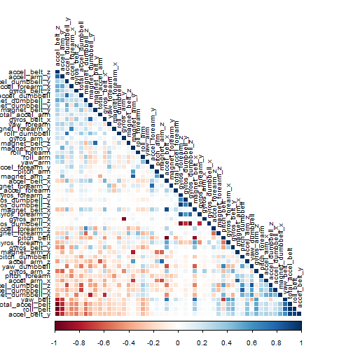

Prediction of Classification of Physical Movement with Accelometer Data. 
========================================================================

## Executive summary

Accelerometers are widely used for assessment of physical activity in childhood to old age [1]. They provide
objective and detailed information on various aspects of physical activity [2]. 
Accelerometers are increasingly used in research regarding physical activity and data output from older models are compared and used with newer models. Using different devices, it is now possible to collect a large amount of data about personal activity relatively inexpensively. These type of devices are part of the quantified self movement - a group of enthusiasts who take measurements about themselves regularly to improve their health, to find patterns in their behavior, or because they are tech geeks. One thing that people regularly do is quantify how much of a particular activity they do, but they rarely quantify how well they do it. 
In this project we aim to analyze data from accelometers on the belt, forearm, arm, and dumbel of six participants in order to determine whether a particular form of exercise if performed correctly. 

## PREPROCESSING DATA : Cleaning and Partitioning

In this project data from accelometers measured at different locations of body (belt, forearm, arm, dumbel) are collected [3]. Before building the model, it is necessary to read the data sets, extract all the needed information measured from different places of the body and split it into two data sets.These are the steps:

### 1. Reading data
Once data is downloaded and saved in the working directory, datasets are read.   

```r
pathFeat <- file.path(getwd(), "pml-training.csv")
pmlTrain <- read.csv(pathFeat, header = TRUE, na.strings = c("NA", ""))
pathFeat2 <- file.path(getwd(), "pml-testing.csv")
pmlnoClass <- read.csv(pathFeat2, header = TRUE, na.string = c("NA", ""))
```


### 2. Cleaning data set 
After reading both data sets, is recommended to remove columns mostly filled with missing values (NAs, empty spaces, etc...) in the original data sets. To do this, we therefore identify the columns which have their contents filled in. After that, we remove them. 

```r
pmlTrainingCompleteCols <- pmlTrain[, (colSums(is.na(pmlTrain)) == 0)]
```

Furthermore, we create another logical vector in order to delete uneccesary columns from the datasets. Column names containing the following strings ("x", "user_name", "timestamp", "new_window") will be dropped. As said before, we will create a logical vector which has the mentioned condition.

```r
ColRemove <- grep("X|user_name|timestamp|new_window|num_window", colnames(pmlTrainingCompleteCols))
pmlTrainingFinal <- pmlTrainingCompleteCols[, -ColRemove]
pmlnoClassFinal <- pmlnoClass[, -ColRemove]
dim(pmlTrainingFinal)
```

```
## [1] 19622    53
```

```r
dim(pmlnoClassFinal)
```

```
## [1]  20 153
```

### 3. Partitioning the data set
The pmlTrain data set will be splitted into two sets, the first one to train the model and the second to test it. Finally we will predict our results in the pmlnoClass set (no class variable is this database). 

```r
library(caret)
```

```
## Loading required package: lattice
## Loading required package: ggplot2
```

```r
set.seed(340821)
classe <- createDataPartition(pmlTrainingFinal$classe, p = 0.75, list = F)
TrainingDef <- pmlTrainingFinal[classe, ]
TestDef <- pmlTrainingFinal[-classe, ]
dim(TrainingDef)
```

```
## [1] 14718    53
```

```r
dim(TestDef)
```

```
## [1] 4904   53
```

### 4. Exploratory Data Analysis
Focusing on the results shown above, after removing the unnecessary columns, both data sets have 53 columns. In order to assess the correlations among the observed features, a correlation matrix plot has been performed. 
This will allow us more information. 

```r
library(corrplot)
corMatrix <- cor(TrainingDef[, -53])
corrplot(corMatrix, order = "FPC", method = "color", type = "lower", tl.cex = 0.8, 
    tl.col = rgb(0, 0, 0))
```

 

This correlation plot shows how correlated the variables are: the darker the color is, the higher the correlation is. 

### 5. Model training and Cross-validation.
For model training we will use random forest algorithm. Compared to other algorithms, random forest test has potential advantages. Briefly, it deals with non-linearity, there is no parameter selection involved and it is robust to outliers and correlated variables. Considering the dimensinality and the design of the data to be analyzed, random forest algorithm was applied. 

In the modeling process, 1000 trees and 5-fold cross validation were considered. These values are drawn from the mentioned algorithm to allow a more accurate solution, trying to achieve the perfect classification. 

```r
library(randomForest)
```

```
## randomForest 4.6-7
## Type rfNews() to see new features/changes/bug fixes.
```

```r
set.seed(3495)
modelRF <- randomForest(classe ~ ., TrainingDef, ntree = 1000, importance = T, 
    cv = 5)
modelRF
```

```
## 
## Call:
##  randomForest(formula = classe ~ ., data = TrainingDef, ntree = 1000,      importance = T, cv = 5) 
##                Type of random forest: classification
##                      Number of trees: 1000
## No. of variables tried at each split: 7
## 
##         OOB estimate of  error rate: 0.46%
## Confusion matrix:
##      A    B    C    D    E class.error
## A 4182    2    0    0    1   0.0007168
## B   12 2832    4    0    0   0.0056180
## C    0   14 2549    4    0   0.0070121
## D    0    0   24 2386    2   0.0107794
## E    0    0    1    3 2702   0.0014782
```

Regarding the results obtained in the model, an excellent classification rate is obtained: Only 0.46% of features are missclassified. The accuracy, after doing cross-validation, is 99.54%. 
Furthermore, applying this algorithm to the test data (second part of the labeled data set) a confusion matrix has been computed to evaluate the accuracy in this set. 

```r
confusionMatrix(predict(modelRF, TestDef), TestDef$classe)
```

```
## Confusion Matrix and Statistics
## 
##           Reference
## Prediction    A    B    C    D    E
##          A 1395    3    0    0    0
##          B    0  944    4    0    0
##          C    0    2  851   10    0
##          D    0    0    0  794    1
##          E    0    0    0    0  900
## 
## Overall Statistics
##                                         
##                Accuracy : 0.996         
##                  95% CI : (0.994, 0.998)
##     No Information Rate : 0.284         
##     P-Value [Acc > NIR] : <2e-16        
##                                         
##                   Kappa : 0.995         
##  Mcnemar's Test P-Value : NA            
## 
## Statistics by Class:
## 
##                      Class: A Class: B Class: C Class: D Class: E
## Sensitivity             1.000    0.995    0.995    0.988    0.999
## Specificity             0.999    0.999    0.997    1.000    1.000
## Pos Pred Value          0.998    0.996    0.986    0.999    1.000
## Neg Pred Value          1.000    0.999    0.999    0.998    1.000
## Prevalence              0.284    0.194    0.174    0.164    0.184
## Detection Rate          0.284    0.192    0.174    0.162    0.184
## Detection Prevalence    0.285    0.193    0.176    0.162    0.184
## Balanced Accuracy       1.000    0.997    0.996    0.994    0.999
```

Regarding the confusion matrix, the accuracy is 99.59%. 

### 6. Prediting in the unlabeled data
As final step, using the prediction model we will predict the appropriate labels for the unlabeled data set. 

```r
pmlAnswers <- predict(modelRF, newdata = pmlnoClass)
pmlAnswers
```

```
##  1  2  3  4  5  6  7  8  9 10 11 12 13 14 15 16 17 18 19 20 
##  B  A  B  A  A  E  D  B  A  A  B  C  B  A  E  E  A  B  B  B 
## Levels: A B C D E
```

Results show that model predicts on the unlabeled data set with an accuracy of 100%. 

### 7. Conclusions
The performed algorithm is very useful to predict different movements measured at different points of the body. 

### 8. References
1. Dencker M, Andersen LB: Accelerometer-measured daily physical activity related to aerobic fitness in children and adolescents. J Sports Sci 2011, 29:887-895.
2. Trost SG: Objective measures of physical activity with youth: current issues, future directions. Exerc Sport Sci Rev 2001, 29:32-36.
3. Velloso, E.; Bulling, A.; Gellersen, H.; Ugulino, W.; Fuks, H. Qualitative Activity Recognition of Weight Lifting Exercises. Proceedings of 4th International Conference in Cooperation with SIGCHI (Augmented Human '13) . Stuttgart, Germany: ACM SIGCHI, 2013.

